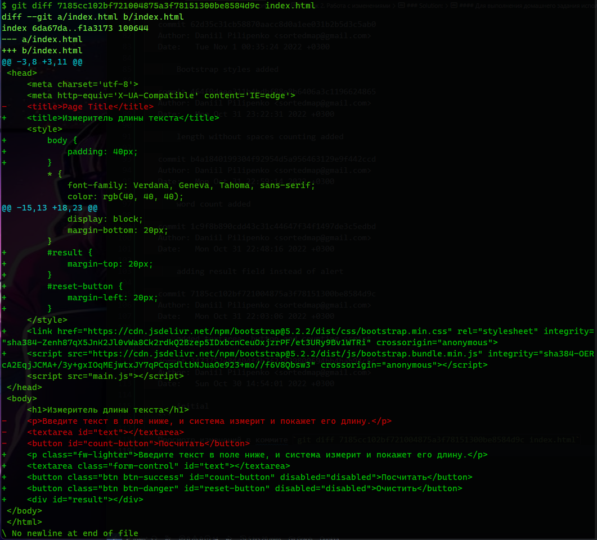

# Урок 2. Работа с изменениями

1. Просмотрите историю коммитов в своём проекте и выберите три случайных коммита. Просмотрите изменения, которые были в них сделаны.

2. Верните эти изменения командой git revert последовательно, чтобы в итоге получилось тоже три коммита.

3. Попробуйте отменить эти три коммита:

- последний — командами git reset --soft и git restore;
- предпоследний — командой git reset --mixed и git restore;
- первый — командой git reset --hard.

### Solution:

#### Для выполнения домашнего задания использовался репозиторий https://github.com/SlavaVasilakiy/Seminar-2

1. Просмотр коммитов

   ```
   $ git log
   commit eb990926f6eab2500f8a5cc346647ee25d13a0ea (HEAD -> main, origin/main, origin/HEAD)
   Author: SlavaVasilakiy <slk55slk@gmail.com>
   Date:   Sat May 27 20:54:15 2023 +0300

       gitignore

   commit 8897d25c3fd2a037185a5e518b32e931b2a3161b (origin/master)
   Author: Daniil Pilipenko <sortedmap@gmail.com>
   Date:   Tue Nov 1 10:42:31 2022 +0300

       refactoring

   commit daaa3d32ff98ffad7321c14815438b28a7583529
   Author: Daniil Pilipenko <sortedmap@gmail.com>
   Date:   Tue Nov 1 10:37:58 2022 +0300

       reset button enabling/disabling added

   commit bbf1b69d61ce9ebadb0ecfe9563a50bf0a88b3d5
   Author: Daniil Pilipenko <sortedmap@gmail.com>
   Date:   Tue Nov 1 10:36:46 2022 +0300

       reset button added

   commit fe4e2639663f50c652dc7dfcae7c715bba3e87f8
   Author: Daniil Pilipenko <sortedmap@gmail.com>
   Date:   Tue Nov 1 10:29:18 2022 +0300

       button inactivation added

   commit d014a17ca049ad5389484b1cf29e695ab7d36dcf
   Author: Daniil Pilipenko <sortedmap@gmail.com>
   Date:   Tue Nov 1 09:20:36 2022 +0300

       text styles changed

   commit 13a902e43c6ffbf36ee553e3d24377bb11e1575c
   Author: Daniil Pilipenko <sortedmap@gmail.com>
   Date:   Tue Nov 1 09:14:44 2022 +0300

       changed styles of form elements

   commit 69ee940cde148081fd3cc1ad44324279b4e9ac0c
   Author: Daniil Pilipenko <sortedmap@gmail.com>
   Date:   Tue Nov 1 09:03:47 2022 +0300

       added logs folder

   commit c7e2f247eee7e5bca2113524d475f305dc603ca3
   Author: Daniil Pilipenko <sortedmap@gmail.com>
   Date:   Tue Nov 1 08:51:42 2022 +0300

       removed word counting function

   commit 560a30066a37aff0f5d5badcf11304744dde74b5
   Author: Daniil Pilipenko <sortedmap@gmail.com>
   Date:   Tue Nov 1 08:51:05 2022 +0300

       removed word counting

   commit 62d35c31cb58870aacc8d0a1ee031b2b5d3c5ab0
   Author: Daniil Pilipenko <sortedmap@gmail.com>
   Date:   Tue Nov 1 00:35:24 2022 +0300

       Bootstrap styles added

   commit 464f0deee311b4bdbf88e8b6406a3c1196624865
   Author: Daniil Pilipenko <sortedmap@gmail.com>
   Date:   Mon Oct 31 23:22:31 2022 +0300

       length without spaces counting added

   commit b4a1840199304f92954d5a956463129e9f442ccd
   Author: Daniil Pilipenko <sortedmap@gmail.com>
   Date:   Mon Oct 31 22:59:14 2022 +0300

       word count added

   commit 1c9f8b890cdd43c31c44647f34f1497de3c5edbd
   Author: Daniil Pilipenko <sortedmap@gmail.com>
   Date:   Mon Oct 31 22:48:16 2022 +0300

       adding result field instead of alert

   commit 7185cc102bf721004875a3f78151300be8584d9c
   Author: Daniil Pilipenko <sortedmap@gmail.com>
   Date:   Mon Oct 31 22:03:06 2022 +0300

       added textarea, button and counting script

   commit 3473752e84494f4b7f23839800694bb4bab94c6c
   Author: Daniil Pilipenko <sortedmap@gmail.com>
   Date:   Sun Oct 30 14:54:01 2022 +0300

       initial
   ```

   Просмотр изменений в коммите `git diff 7185cc102bf721004875a3f78151300be8584d9c index.html` <br>

    <br>

2. Используемые коммиты:

   1. 7185cc102bf721004875a3f78151300be8584d9c
   2. 560a30066a37aff0f5d5badcf11304744dde74b5
   3. 1c9f8b890cdd43c31c44647f34f1497de3c5edbd

   Создадим новую ветку для процедур `git checkout -b reverting` <br>
   `git revert 7185cc102bf721004875a3f78151300be8584d9c` <br>

   ```
       Auto-merging index.html
   CONFLICT (content): Merge conflict in index.html
   CONFLICT (modify/delete): main.js deleted in parent of 7185cc1 (added   textarea, button and counting script) and modified in HEAD.  Version HEAD of  main.js left in tree.
   error: could not revert 7185cc1... added textarea, button and counting script
   hint: After resolving the conflicts, mark them with
   hint: "git add/rm <pathspec>", then run
   hint: "git revert --continue".
   hint: You can instead skip this commit with "git revert --skip".
   hint: To abort and get back to the state before "git revert",
   hint: run "git revert --abort".
   ```

   `git add .` <br>
   `git revert --continue` <br>

   `git revert 560a30066a37aff0f5d5badcf11304744dde74b5` <br>

   `git revert 1c9f8b890cdd43c31c44647f34f1497de3c5edbd` <br>

   ```
       Auto-merging index.html
   CONFLICT (content): Merge conflict in index.html
   Auto-merging main.js
   CONFLICT (content): Merge conflict in main.js
   error: could not revert 1c9f8b8... adding result field instead of alert
   hint: After resolving the conflicts, mark them with
   hint: "git add/rm <pathspec>", then run
   hint: "git revert --continue".
   hint: You can instead skip this commit with "git revert --skip".
   hint: To abort and get back to the state before "git revert",
   hint: run "git revert --abort".
   ```

   `git add .` <br>
   `git revert --continue` <br>

3. Отмена коммитов:

   1. `git reset --soft 7e15297586a0d11b9eefd82ad339eb78b24aa2c1` <br>
      `git status` <br>

      ```
      On branch reverting
      Changes to be committed:
      (use "git restore --staged <file>..." to unstage)
            modified:   index.html
            modified:   main.js
      ```

      `git restore --staged index.html main.js` <br>
      `git restore index.html main.js` <br>

   2. `git reset --mixed cf1bc3870c3f64b9fc2f21ab03053dfa40df8ce0` <br>
      `git status`

      ```
        On branch reverting
        Changes not staged for commit:
          (use "git add <file>..." to update what will be committed)
          (use "git restore <file>..." to discard changes in working directory)
                modified:   index.html
                modified:   main.js

        no changes added to commit (use "git add" and/or "git commit -a")
      ```

      `git restore index.html main.js` <br>

   3. `git reset --hard eb990926f6eab2500f8a5cc346647ee25d13a0ea` <br>

      ```
      HEAD is now at eb99092 gitignore
      ```
